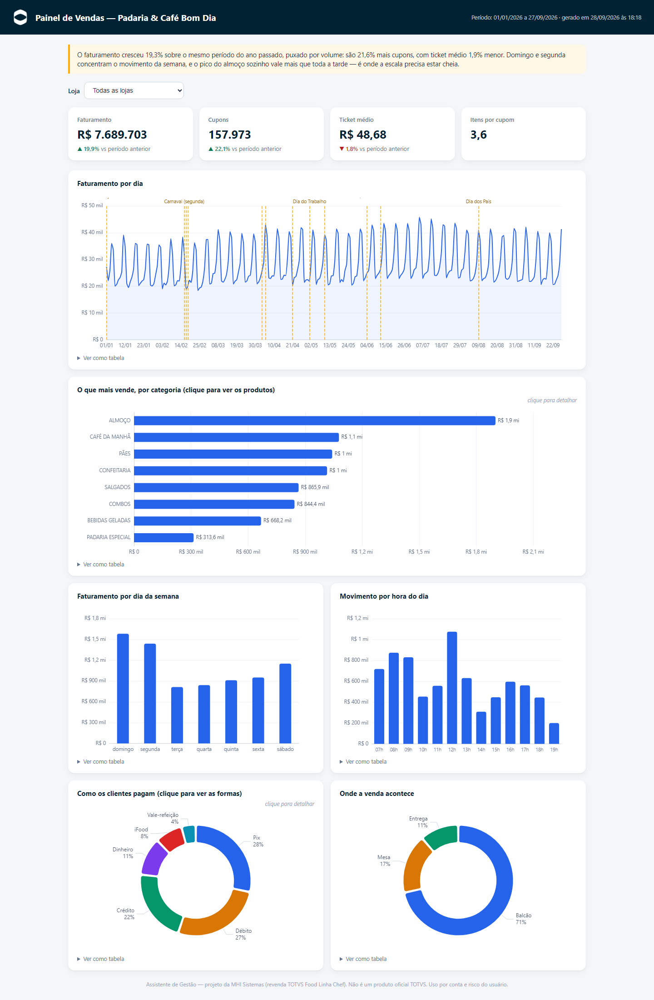
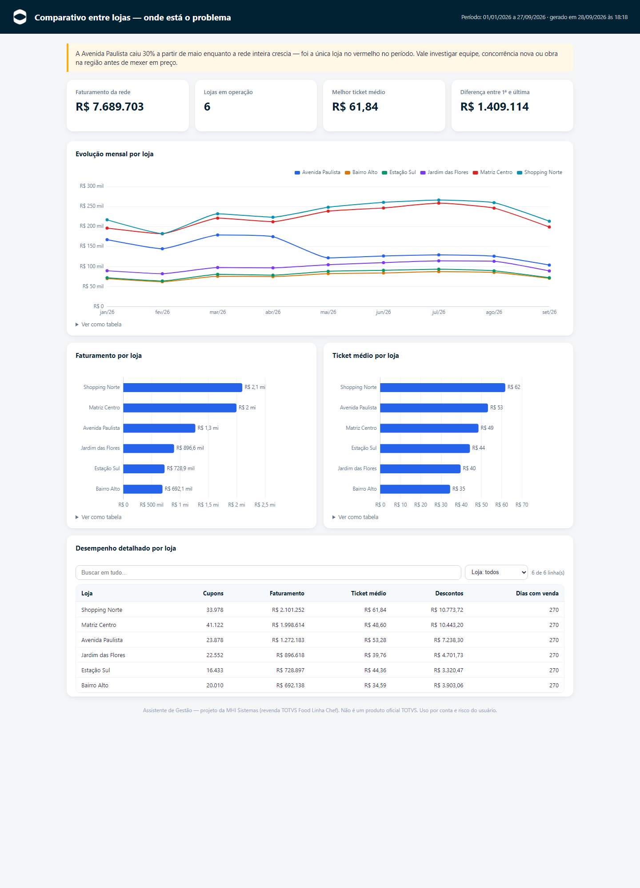
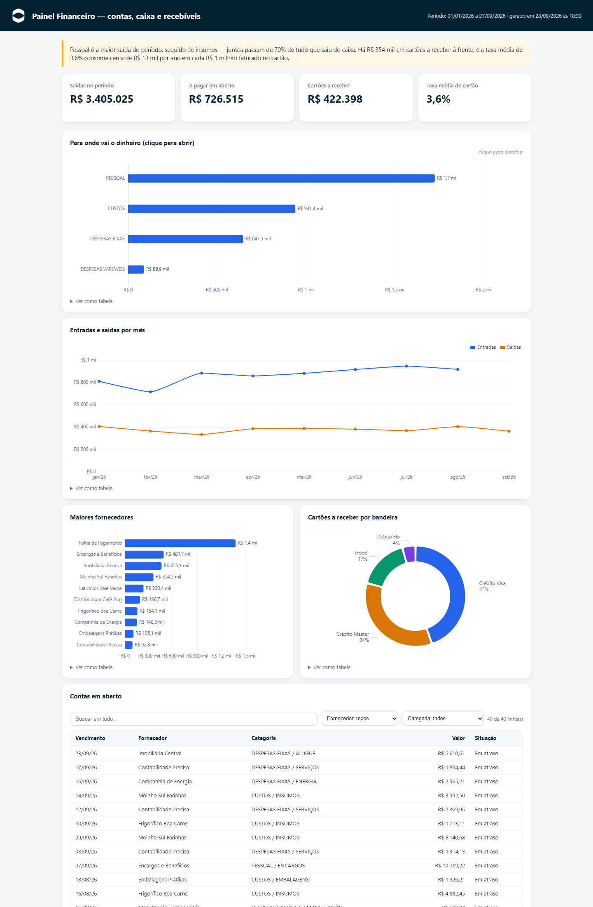
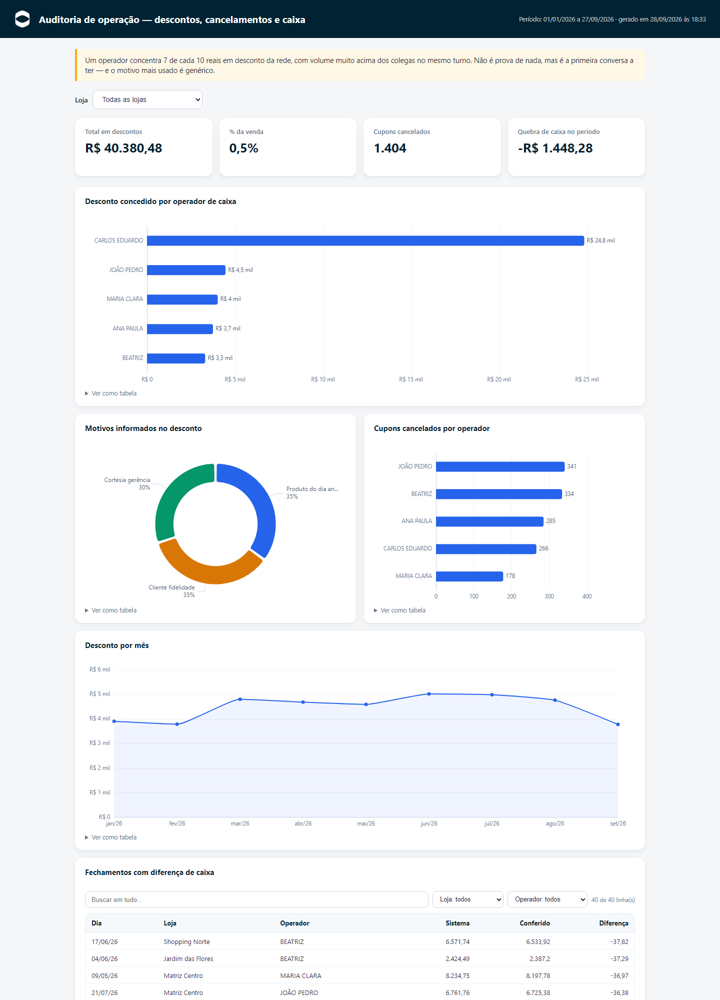
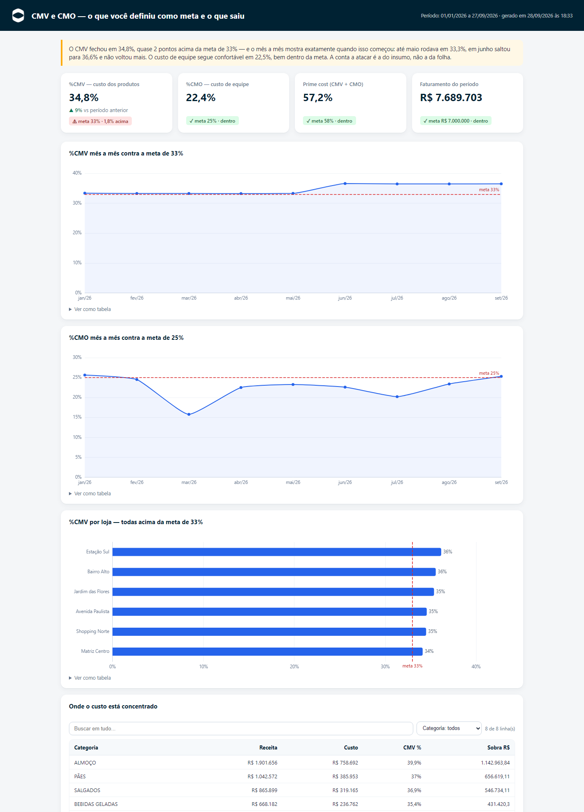
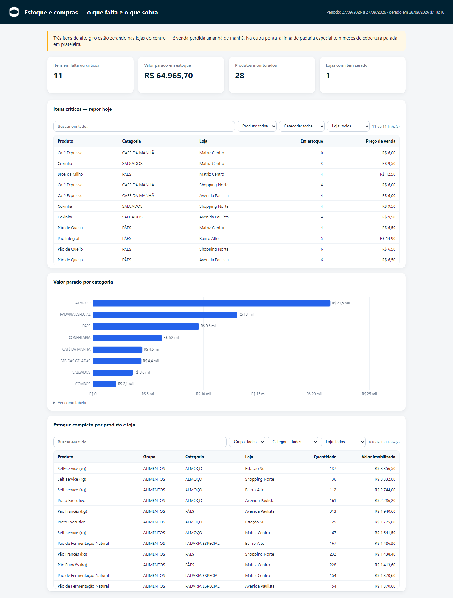
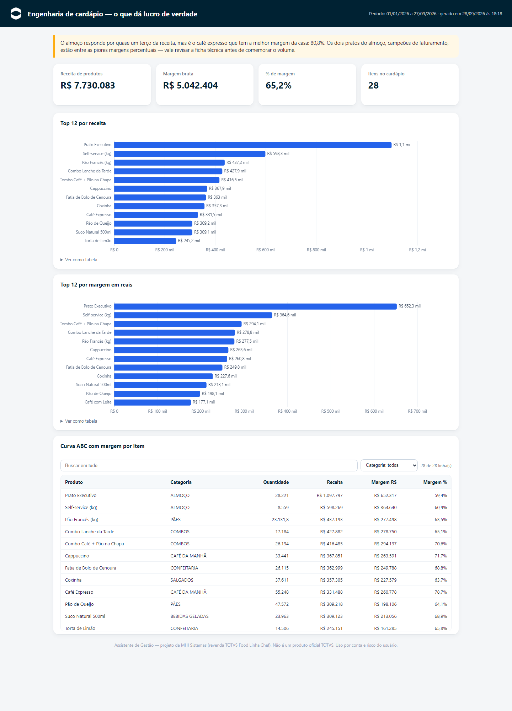

# 🍽️ Assistente de Gestão para TOTVS Food Linha Chef

**Converse com os dados do seu restaurante.** Este projeto transforma uma
inteligência artificial (Claude Code ou Codex) no seu analista de gestão pessoal:
ele busca os dados da sua loja no sistema TOTVS Food Linha Chef (ChefWeb), guarda
tudo no seu computador e responde perguntas como:

> "Qual foi meu faturamento esta semana?"
> "Quais os 10 produtos que mais vendem?"
> "Compare setembro com agosto"
> "Quais contas vencem nos próximos dias?"
> "Monte um painel com gráficos das minhas vendas"
> "Por que meu faturamento caiu este mês?"
> "Tem alguma coisa fora do normal na operação?"

**Você não precisa saber nada de tecnologia.** Depois de instalar, é só conversar
em português — o assistente faz todo o trabalho técnico sozinho.
Funciona no **Windows** e no **Mac**.

É **gratuito e de código aberto** (o uso do Claude Code ou Codex requer uma
assinatura própria dessas ferramentas).

---

## 👀 O que ele entrega

Painéis assim saem de **uma frase sua**, em segundos — e abrem no navegador,
funcionam sem internet e podem ser enviados para quem você quiser.

### "Monte um painel das minhas vendas"

Faturamento, cupons e ticket médio já comparados com o ano passado; o
movimento dia a dia com os feriados marcados; o que mais vende **por
categoria, clicando para abrir até o produto**; os horários de pico; e como os
clientes pagam. O seletor no topo refaz tudo para uma loja só.

### "Compare minhas lojas"

Aqui o assistente não só mostra: ele aponta. Uma das lojas caiu 30% a partir
de maio enquanto a rede crescia — o tipo de coisa que passa despercebida no
número consolidado e aparece na primeira olhada quando cada loja tem sua linha.

### "Como está meu financeiro?"

Para onde o dinheiro está indo (com mergulho no plano de contas), entradas
contra saídas mês a mês, os maiores fornecedores, o que ainda vai cair de
cartão e a lista de contas em aberto — com busca e filtros.

### "Tem algo errado na operação?"

Descontos e cancelamentos por operador, motivos informados e as diferenças de
caixa, fechamento a fechamento. No exemplo, **um operador concentra 7 de cada
10 reais em desconto da rede** — não prova nada sozinho, mas é a conversa que
ninguém estava tendo.

### "Como está meu CMV contra a minha meta?"

Você define suas metas conversando — *"minha meta de CMV é 33%"* — e todo
indicador que tem meta passa a aparecer comparado com ela: **verde quando está
dentro, vermelho com a diferença exata quando estoura**. No exemplo, o custo
dos produtos furou a meta e o gráfico mostra **em que mês a pressão começou**;
o custo de equipe, no mesmo período, segue folgado.

### "O que está acabando?" · "O que dá lucro de verdade?"

| Estoque e compras | Engenharia de cardápio |
|---|---|
|  |  |
| Insumos e produtos acabando, valor parado e a posição por loja — **sem confundir prato preparado com item de prateleira**: café e self-service não têm estoque, quem tem são os insumos da ficha | Curva ABC com **margem por item**: o campeão de volume quase nunca é o campeão de lucro |

> Os números e nomes destas imagens são de uma **rede fictícia**, criada só
> para a demonstração. Seus dados nunca saem do seu computador.

---

## 🚀 Como começar

São **3 passos** — e o assistente faz o passo 2 e o 3 sozinho, você só conversa.

### 1. Instale o assistente de IA

Você precisa de **um** destes (qualquer um funciona):

- **Claude Code** (Anthropic)
- **Codex** (OpenAI)

A instalação é rápida e o passo a passo, feito para quem nunca usou essas
ferramentas, está em **[docs/instalacao.md](docs/instalacao.md)**.

### 2. Peça a instalação ao assistente

Abra o Claude Code (ou o Codex) — **em qualquer pasta, tanto faz** — e escreva:

> **Instale o assistente de gestão do TOTVS Food Linha Chef:**
> **https://github.com/mhi-sistemas/totvs-food-linha-chef-gestor**

Pronto. Ele baixa o projeto e prepara tudo no seu computador. Você não precisa
baixar nada à mão nem abrir pasta nenhuma — e, nas próximas vezes, é só abrir a
mesma ferramenta de IA na pasta do assistente e continuar a conversa.

### 3. Conecte sua loja

Logo em seguida o assistente abre uma **página segura no seu navegador** para
você informar os dados de acesso da TOTVS — a própria página explica onde
encontrar cada um.

Tenha em mãos **usuário**, **senha** e **número de série da loja**. Não sabe
onde conseguir? Veja **[docs/como-obter-credenciais.md](docs/como-obter-credenciais.md)**.

A partir daí é só perguntar: *"como foram minhas vendas na semana passada?"*

---

<b>Instruções para o assistente de IA</b> — você, gestor, não precisa ler isto

Se um gestor pediu para instalar este projeto, siga este roteiro:

1. **Confira o Node.js.** Rode `node --version`. Precisa ser **22.5 ou maior**.
   Se não existir ou for menor, oriente a instalar a versão LTS em
   <https://nodejs.org/pt> e **pare por aqui** — sem Node nada funciona.
2. **Baixe o projeto** em `assistente-totvs-chef`, dentro da pasta pessoal do
   gestor (`$HOME` no Mac/Linux, `%USERPROFILE%` no Windows). Se já existir uma
   pasta ali, não sobrescreva: rode `git pull` para atualizar.
   - Com Git disponível: `git clone https://github.com/mhi-sistemas/totvs-food-linha-chef-gestor.git <destino>`
   - Sem Git: baixe
     `https://codeload.github.com/mhi-sistemas/totvs-food-linha-chef-gestor/zip/refs/heads/master`
     e extraia. **Atenção ao extrator**: no Windows o `tar` que aparece no PATH do
     Git Bash é o GNU tar e **não abre .zip** — use `C:/Windows/System32/tar.exe -xf`
     (bsdtar) ou, no PowerShell, `Expand-Archive`. No macOS, `unzip` ou `tar -xf`
     resolvem. O ZIP vem com uma pasta de topo terminada em `-master`: renomeie
     essa pasta para o destino final.
3. **Prepare o projeto**, de dentro da pasta baixada:
   `node --no-warnings scripts/instalar.mjs`
   Isso cria as pastas locais e monta o banco.
4. **Leia o `CLAUDE.md`** (ou o `AGENTS.md`) da pasta baixada e siga aquelas
   instruções pelo resto da conversa — elas definem como você deve falar com o
   gestor. Faça isso mesmo que você tenha sido aberto em outra pasta.
5. **Conduza o onboarding**: `node --no-warnings scripts/configurar.mjs` abre a
   página de configuração no navegador. **Nunca peça senha pelo chat.**
6. Ao terminar, ensine o gestor a voltar: abrir a ferramenta de IA que ele usa
   **na pasta do assistente** (diga o caminho dela) e conversar normalmente.
   Se ele usa um app de desktop, mostre onde apontar a pasta.

Regra que vale desde a primeira mensagem: o gestor **não tem conhecimento
técnico**. Nada de "clonar repositório", "rodar script" ou "terminal" — diga
"vou baixar o assistente" e "vou preparar seu computador".

---

## 💬 O que você pode perguntar

| Tema | Exemplos |
|---|---|
| **Vendas** | faturamento, ticket médio, produtos mais vendidos, horário de pico, comparativos, descontos, cancelamentos |
| **Financeiro** | contas a pagar, livro caixa, quanto vai receber de cartão, diferenças de caixa, sangrias |
| **Estoque** | o que está acabando, valor parado em estoque, cobertura em dias |
| **Painéis** | relatórios visuais com gráficos, prontos para compartilhar |
| **Análises** | por que caiu, o que está fora do padrão, comparação entre lojas, simulações |
| **Arquivos** | planilhas Excel, PDFs para imprimir e documentos Word |
| **Resumos** | "como foi ontem?", "fecha a semana pra mim", "fechamento do mês" |

Tem **mais de uma loja ou mais de um grupo**? O assistente conecta quantos
grupos você tiver e compara todos — e você pode acrescentar novos quando abrir
uma loja.

Lista completa de exemplos: **[docs/perguntas-exemplo.md](docs/perguntas-exemplo.md)**

## 📥 Seus dados, desde o primeiro dia

- **Você já tem o que analisar hoje.** Assim que conecta a loja, o assistente
  busca na hora tudo o que o sistema da TOTVS libera a qualquer momento —
  vendas recentes, caixa, financeiro, notas, catálogo e estoque — e te diz o
  que já dá para olhar. Pode pedir um painel no primeiro minuto.
- **Você escolhe quanto histórico quer**: desde a primeira venda de cada loja
  ou só os últimos anos. O sistema da TOTVS só libera dados antigos de
  madrugada, então o assistente **agenda a busca sozinho** e vai trazendo aos
  poucos — é só perguntar *"como está a carga?"* para ver o progresso.
- **Enquanto o histórico chega**, ele já aponta as primeiras descobertas e
  entrega uma lista de arrumação do seu cadastro no ChefWeb (custos zerados,
  produtos sem categoria) — corrigir agora faz seus indicadores nascerem
  confiáveis.

## 🤖 O que ele faz sozinho, todo dia

Depois de configurado, o assistente trabalha mesmo com você fora do
computador (basta que ele esteja ligado, no horário que você escolher):

- **Busca o movimento de ontem** de todas as suas lojas — e, se o computador
  ficou desligado alguns dias, **recupera sozinho os dias perdidos**.
- **Tira a fotografia diária do seu estoque**: é ela que permite calcular o
  CMV real mais adiante.
- **Guarda uma cópia de segurança** dos seus dados na pasta Documentos (sem
  senhas) e mantém as 14 mais recentes.
- **Se mantém atualizado**: confere se há versão nova e te conta o que melhorou.
- **Te avisa quando algo dá errado.** Se uma busca falhar, você fica sabendo
  na primeira conversa do dia, em português claro: qual informação faltou, de
  qual loja e o que fazer.
- **Monta o chamado para o suporte da TOTVS.** Quando o problema é do sistema
  deles, o assistente escreve o texto do chamado com tudo que o suporte precisa
  para reproduzir — você só aprova. Antes disso, ele confirma o defeito em
  várias tentativas, para você nunca abrir ticket por alarme falso.

## 📊 Métricas, análises e relatórios prontos

**Indicadores com fórmula oficial** (catálogo completo em
[docs/catalogo-metricas.md](docs/catalogo-metricas.md)):

- **Vendas**: faturamento, ticket médio (por cupom e por pessoa), itens por
  cupom, mix por categoria (grupo → subgrupo → produto), curva ABC,
  **vendas por setor** (balcão, mesa, cartão, entrega), horários de pico,
  promoções, descontos e cancelamentos por operador e motivo (auditoria);
- **Custos e resultado**: **CMV** teórico (ficha técnica) e real, **CMO —
  custo de mão de obra** (pelos seus planos de contas, com a sua
  confirmação), **prime cost**, margem por produto, **lucro líquido pela
  DRE**;
- **Operação**: taxa de ocupação e giro de mesas, quebra de caixa
  (borderô × sistema × recebido), taxas de cartão reais, giro e cobertura de
  estoque, itens críticos;
- **Fiscal**: auditoria de NCM/CFOP/CST/CSOSN, conferência de cálculo,
  carga efetiva e a transição IBS/CBS da reforma — como indício para revisar
  com seu contador;
- **Inteligência**: o que fugiu do padrão (anomalias), por que subiu ou caiu
  (decomposição), comparação entre lojas, oportunidades de venda casada,
  simulação de cenários, feriados e eventos explicando variações, e o diário
  de decisões — o assistente registra o que recomendou e **volta para medir
  se funcionou**.

**Entregas**: **DRE Gerencial dinâmica** (mensal/anual × competência/caixa,
com gráfico de cascata e plano de contas que abre), **painéis interativos**
(filtro por loja, clique para detalhar até o produto, feriados marcados,
funcionam sem internet e no celular), **relatórios em tabela** com busca e
ordenação, resumos prontos para o dia, a semana e o fechamento do mês,
planilhas Excel já formatadas (R$, datas, %), documentos Word e PDF — e envio
por e-mail pela sua própria conta, se você ativar. Cardápio completo em
[docs/catalogo-relatorios.md](docs/catalogo-relatorios.md).

### Não achou o indicador do seu jeito? Peça — conversando

O assistente **cria novas métricas, indicadores, análises e painéis com você,
por conversa, sem nenhum conhecimento técnico**: *"crie um indicador meu de
faturamento por funcionário"*, *"monta um relatório de abertura de sábado e
salva como meu padrão"*, *"no meu painel, tira o gráfico de pagamentos"*. Ele
valida a fórmula, guarda do seu jeito e passa a usar sempre — inclusive em
entregas automáticas nos horários que você escolher.

## 🎯 Do seu jeito, e com a sua cara

- **Suas metas valem mais que qualquer referência.** Diga *"minha meta de CMV
  é 30%"* ou *"quero faturar 180 mil este mês"* — por rede, por loja ou por
  produto — e todo indicador com meta passa a ser mostrado comparado com ela.
- **Ele lembra do que você ensina.** Preferências (*"sempre me mostra em
  percentual"*), apelidos de produto e de loja, fatos da sua operação
  (*"fechamos às segundas"*) e decisões combinadas ficam guardados **entre as
  conversas** — você não repete nada na próxima vez.
- **Seus nomes, não os do sistema.** O ChefWeb deixa você cadastrar formas de
  pagamento com nome livre ("PIX SANTANDER", "VISA CRÉDITO"). O assistente
  propõe o agrupamento (Pix, Crédito, Débito, Vale...) e você confirma — as
  análises passam a usar as suas categorias. Mesma coisa com os planos de
  contas, para o cálculo do custo de equipe.
- **Dê um nome a ele** e diga como prefere que fale com você: direto ao ponto
  ou explicando os porquês.
- **Sua marca nos relatórios**: envie a logomarca da sua empresa e o assistente
  identifica as cores dela sozinho — painéis, DRE e relatórios passam a sair
  com a identidade da sua casa.
- **Seu segmento importa**: pizzaria, padaria, quilo, bar, lanchonete... ele usa
  as faixas de referência certas para o seu tipo de casa, e aprende as
  referências que você informar.

## 🗣️ Achou um problema ou tem uma ideia?

Diga a ele. O assistente escreve o relato para a equipe que mantém o projeto,
lê o texto para você aprovar e envia — sem você abrir site nenhum. Se quiser
receber a resposta por e-mail, ele te ajuda a criar a conta gratuita onde os
relatos ficam. Ele também registra sozinho os problemas que encontrar enquanto
trabalha.

## 🔒 Seus dados ficam com você

- As informações da sua loja são gravadas **apenas no seu computador**.
- Suas senhas ficam em um arquivo local que **nunca** é enviado para a internet
  nem para este site — e você as digita numa página segura no seu navegador,
  nunca no chat.
- O assistente **só lê** dados do sistema da TOTVS — ele nunca altera nada lá.
- A cópia de segurança fica na **sua** pasta Documentos e **nunca inclui
  senhas**; o banco de dados, que tem dados pessoais dos seus clientes, nunca
  é enviado por e-mail.
- **Não há servidor no meio, nem cadastro, nem telemetria.** O assistente só
  acessa a internet para falar com o sistema da TOTVS e para checar se há
  versão nova deste projeto no GitHub. Nada da sua operação sai daí.
- As duas únicas coisas que saem do seu computador por vontade sua: o texto de
  um relato que você aprovar e, se você quiser entrar na lista de espera do
  comparativo de mercado, os dados de contato que você mesmo preencher.
  Histórico de versões no [CHANGELOG.md](CHANGELOG.md).

Detalhes: **[docs/seguranca.md](docs/seguranca.md)**

## 🏁 Em breve: comparativo com o mercado

Saber que seu CMV é 34% é bom; saber que casas parecidas com a sua ficam em
29% é o que muda decisão. Estamos construindo um **benchmark colaborativo e
gratuito** — números agregados e anônimos, por segmento, estado e porte. Peça
ao assistente para entrar na lista de espera: quem está nela participa
primeiro, e a página explica exatamente o que seria compartilhado.

## 📚 Documentação

| Documento | Para quem |
|---|---|
| [docs/instalacao.md](docs/instalacao.md) | Gestores — instalar tudo do zero |
| [docs/como-obter-credenciais.md](docs/como-obter-credenciais.md) | Gestores — conseguir os dados de acesso |
| [docs/perguntas-exemplo.md](docs/perguntas-exemplo.md) | Gestores — ideias de perguntas |
| [docs/seguranca.md](docs/seguranca.md) | Gestores — onde ficam seus dados |
| [docs/catalogo-relatorios.md](docs/catalogo-relatorios.md) | Gestores — relatórios e painéis prontos |
| [docs/catalogo-metricas.md](docs/catalogo-metricas.md) | Técnicos/consultores — fórmulas dos indicadores |
| [docs/dicionario-de-dados.md](docs/dicionario-de-dados.md) | Técnicos — qual campo usar em cada cálculo |
| [docs/banco-de-dados.md](docs/banco-de-dados.md) | Técnicos — estrutura dos dados locais |
| [docs/api/](docs/api/) | Técnicos — referência das APIs do ChefWeb |

## 🤝 Contribua

Gestor: é mais fácil pedir ao próprio assistente (seção acima) — ele escreve o
relato por você. Se preferir, abra uma [issue](../../issues) direto, em
português, do seu jeito.

Vai enviar código? Leia antes o [CONTRIBUTING.md](CONTRIBUTING.md): o projeto
roda **sem nenhuma dependência externa** (só o Node), em Windows e macOS, com
código e comentários em português.

## ⚖️ Sobre o projeto e aviso legal

Este projeto é de autoria da **[MHI Sistemas](https://www.mhi.com.br)**, revenda
do TOTVS Food Linha Chef, e é disponibilizado gratuitamente à comunidade de
gestores de food service.

- **Não é um projeto oficial da TOTVS.** "TOTVS" é marca registrada da TOTVS
  S.A.; "Chef" e "ChefWeb" identificam produtos dela e são citados aqui apenas
  para indicar o sistema ao qual o assistente se conecta.
- A atribuição de autoria presente no código, na documentação, nas telas e
  nos arquivos gerados **deve ser mantida** — veja [NOTICE](NOTICE).
- **O uso é por conta e risco do usuário**: o software é fornecido "como está",
  sem garantias de qualquer tipo, conforme a licença [MIT](LICENSE). Confira
  sempre números importantes diretamente no sistema oficial antes de tomar
  decisões críticas.
  
🇧🇷 Deus, Pátria, Família e Liberdade
