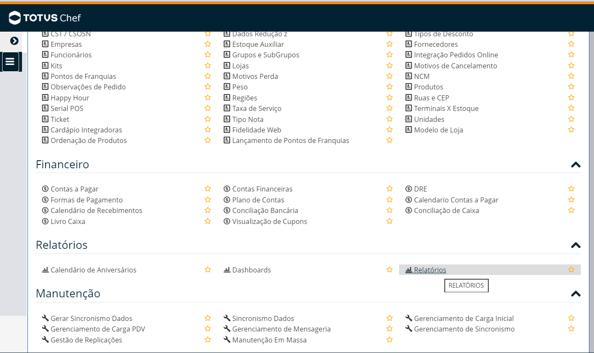
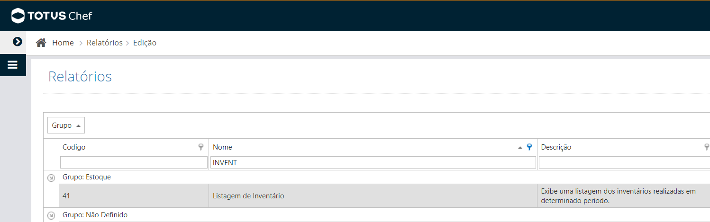
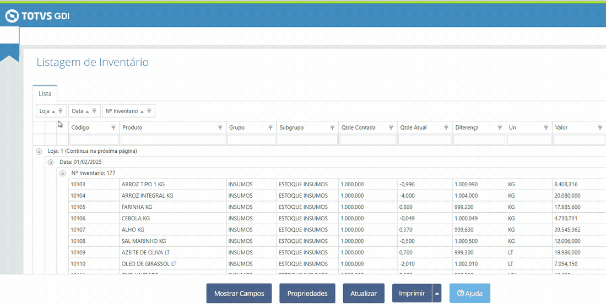

# Como exportar o inventário do ChefWeb

Este passo a passo serve ao **assistente**, para guiar o gestor pela tela do
ChefWeb. O inventário contado é o que permite calcular o **CMV real** de meses
que já passaram: o sistema da TOTVS só informa a posição de estoque de hoje,
nunca a de uma data anterior, então sem o inventário não há como reconstruir
quanto de mercadoria havia no início e no fim de um mês fechado.

O ideal é o inventário do **primeiro e do último dia do mês**. Com essas duas
contagens, mais as notas de entrada do período, o CMV do mês fecha.

## 1. Abrir o relatório

No menu do ChefWeb: **Relatórios → Relatórios**.



Na lista que abre, procure por `INVENT` na coluna Nome. O relatório é o
**41 — Listagem de Inventário** ("Exibe uma listagem dos inventários
realizadas em determinado período"), do grupo Estoque.



Escolha o período desejado e confirme. O relatório traz **todos os inventários
realizados** naquele intervalo.

## 2. Trazer Loja, Data e Nº Inventário para a tabela, e exportar em Excel

O vídeo abaixo mostra os dois passos inteiros — arrastar os campos e salvar o
arquivo:



**Arrastar os campos é obrigatório.** Por padrão o relatório usa Loja, Data e
Nº Inventário como *agrupadores*: eles aparecem como caixinhas acima da tabela,
e não como colunas. Sem eles nas colunas, todas as contagens saem misturadas no
arquivo e não há como saber de que dia e de que loja é cada linha. Arraste cada
caixinha para dentro da tabela, na altura do cabeçalho das colunas.

Ao final, a tabela precisa ter as colunas **Loja**, **Data**, **Nº Inventario**,
**Código**, **Produto**, **Grupo**, **Subgrupo**, **Qtde Contada**,
**Qtde Atual**, **Diferença**, **Un**, **Valor** e **Motivo**.

Para salvar, clique na seta ao lado do botão **Imprimir** e escolha **Excel**.

> ⚠️ **Não use a opção CSV.** A exportação em CSV do ChefWeb tem um defeito:
> ela ignora as colunas que foram arrastadas do agrupador e sai sempre sem
> Loja, Data e Nº Inventário — justamente o que torna o arquivo utilizável.
> O assistente avisa quando recebe um arquivo assim.

## 3. Entregar o arquivo ao assistente

Basta dizer onde o arquivo foi salvo. O assistente importa com:

```
node --no-warnings scripts/inventario.mjs importar --arquivo "<caminho da planilha>"
```

A importação é segura de repetir: reimportar o mesmo arquivo não duplica nada.
O comando mostra quantos inventários encontrou, de que datas e lojas, e avisa
se faltar alguma informação.

## O que o assistente aproveita do arquivo

- **Qtde Contada** é a contagem física, e é ela que vale como posição de
  estoque da data — não a Qtde Atual, que é o saldo que o sistema achava que
  tinha.
- **Valor** é o valor da *diferença* entre a contagem e o sistema, não o do
  estoque contado. Dividido pela diferença, ele revela o **custo unitário
  praticado naquela data** — o único custo histórico que o ChefWeb entrega,
  já que o cadastro de produtos é sobrescrito a cada atualização.
- Uma contagem **parcial** (poucos produtos) não serve para calcular CMV. O
  assistente avisa quando as duas pontas do período cobrem quantidades de
  itens muito diferentes.
